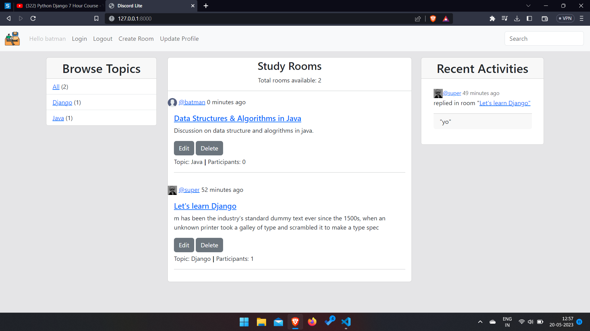
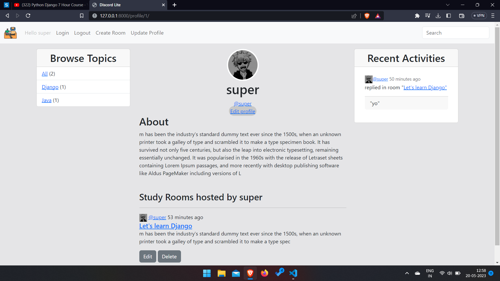
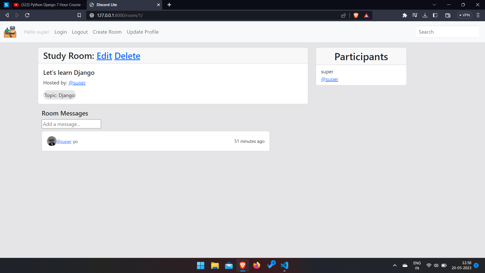

# Study Room
 
**Live link :- https://study-app.onrender.com**

**Run command in shell/teminal**
> python manage.py runserver

* A django web app with **CRUD** functionality.

## Home Page

## User Profile Page

## Inside a Room

